# 🧾 CryptoVitae - NFT Resume Platform

Author: Kevin Peter
Email: kpk4354@nyu.edu

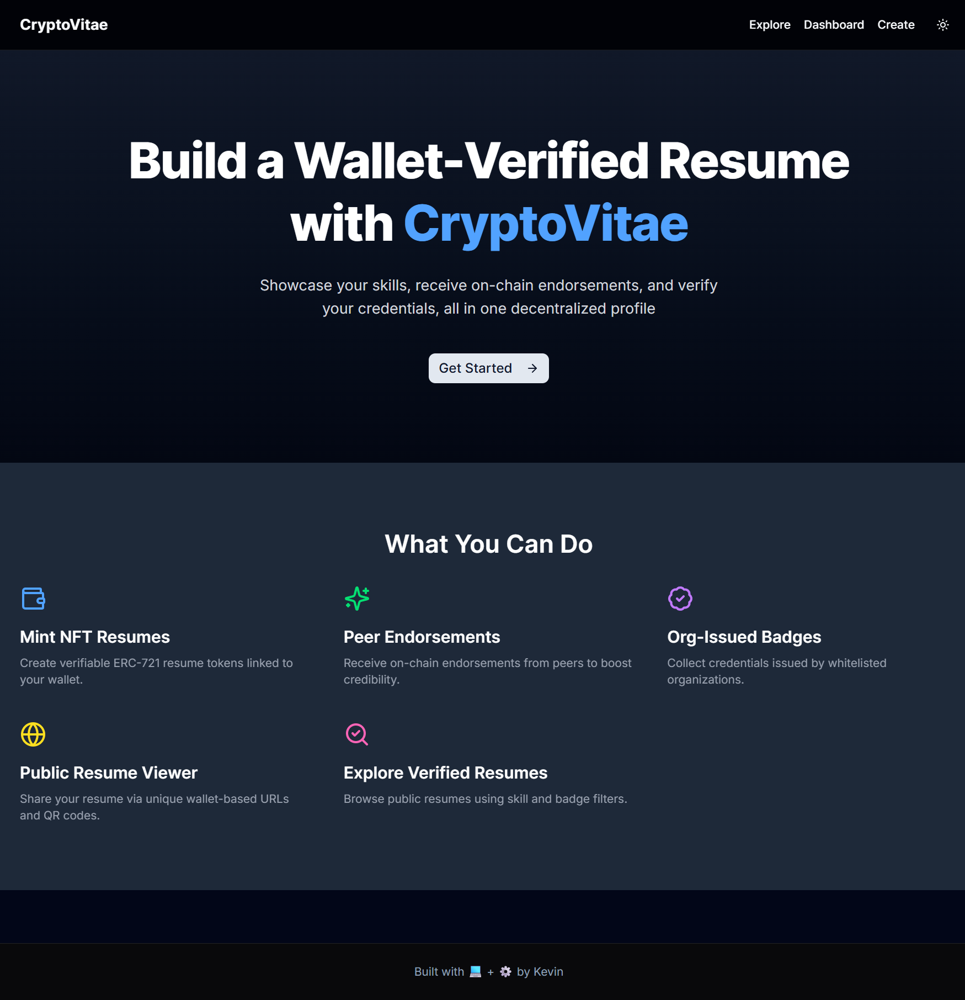</img>

CryptoVitae is a decentralized resume builder and credential verification platform powered by Ethereum smart contracts. Users can mint their resume as an NFT, receive verifiable endorsements from peers, and collect organizational badges, all tied to their wallet.

## 📸 Screenshots

### 🏠 Homepage

Landing page prompting users to connect their wallet and begin building a wallet-verified resume.


### 👥 Ganache (Local Ethereum network simulator) Test Accounts

Set of local Ethereum test accounts preloaded with ETH on Ganache.
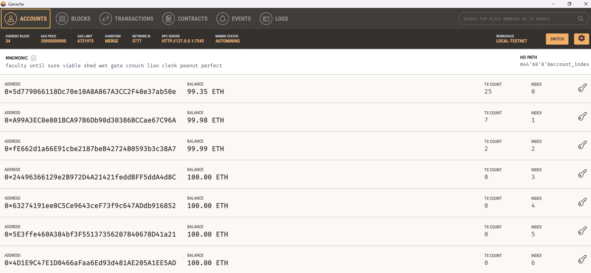

### ➕ Add Wallet to MetaMask

Interface for adding a wallet address to MetaMask manually.
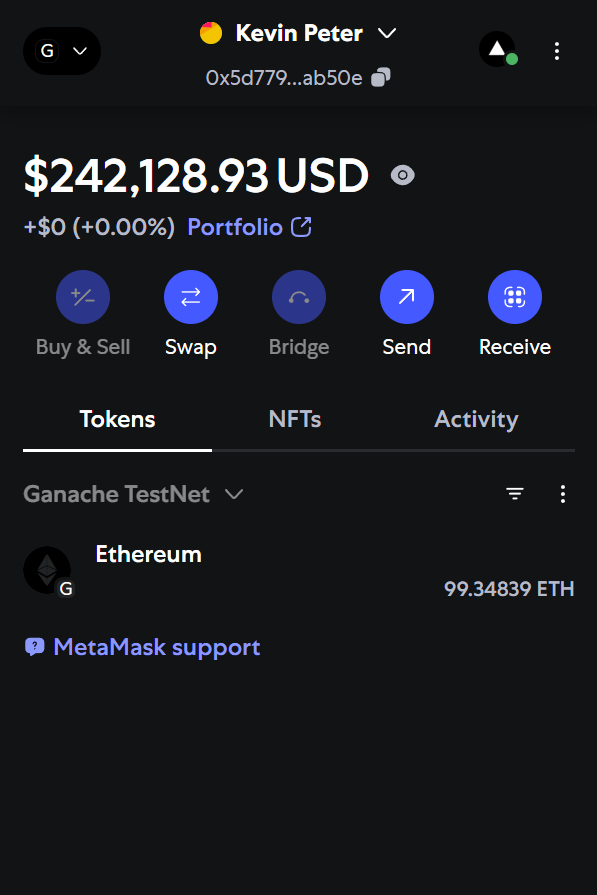

### 👛 Imported Wallets

View of MetaMask showing imported test wallets for local development.
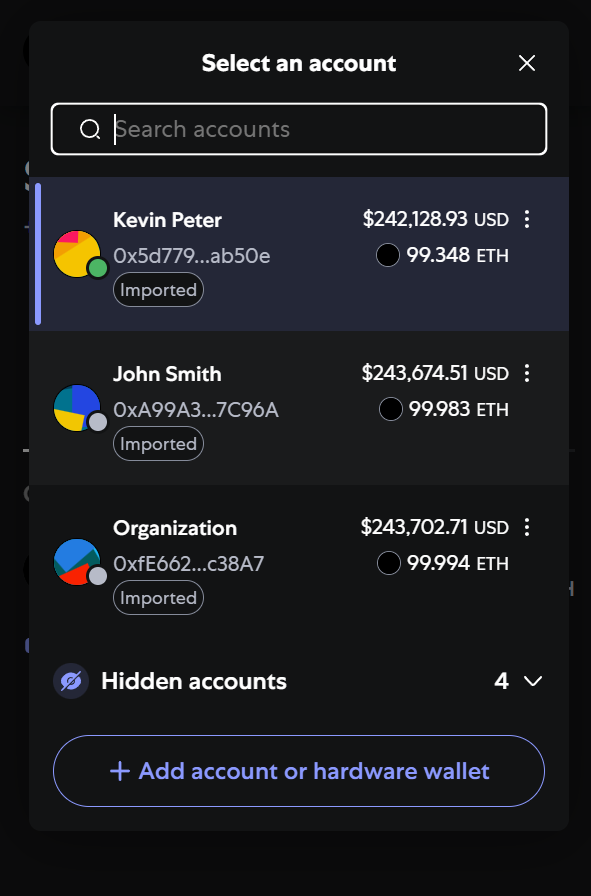

### 🔍 Explore Page

Users can browse public resumes, filter by tags or credentials, and view wallet-linked resumes.
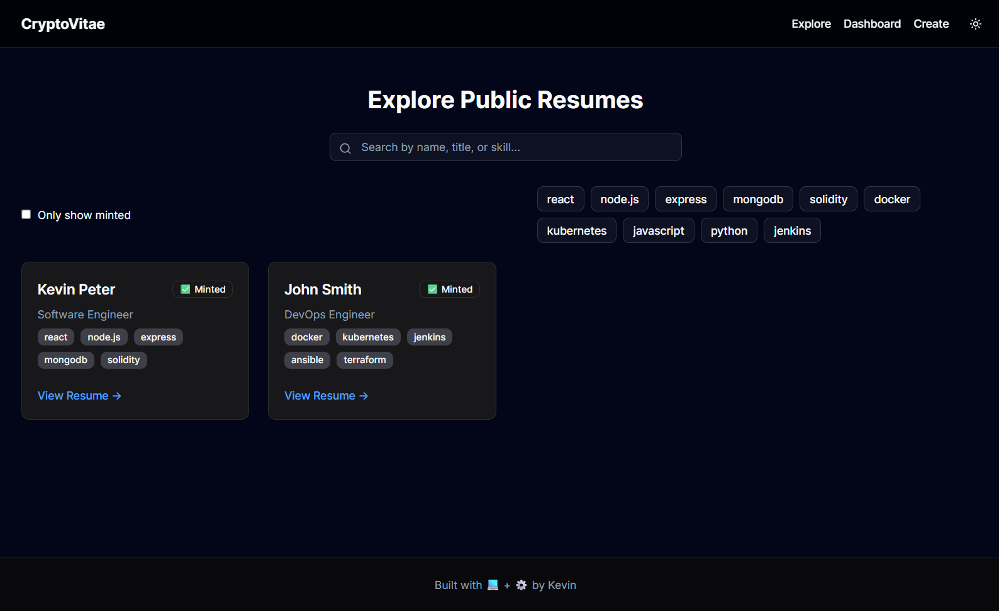

### 📄 Public Resume Viewer

Displays a user’s resume with endorsements and badges, accessible via wallet address.
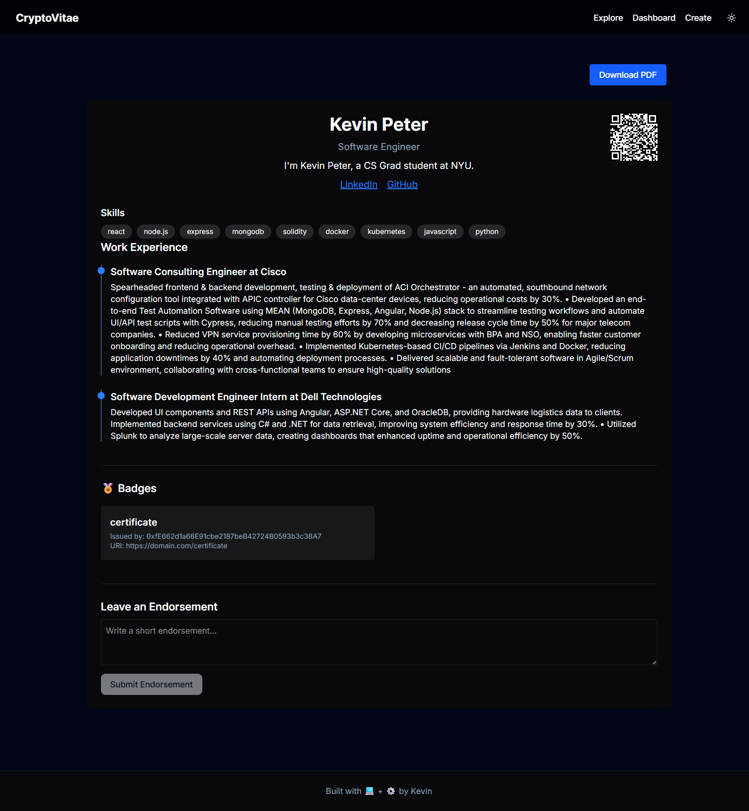

### ✏️ Resume Edit Page

Resume creation form where users input their profile, work experience, and skills.
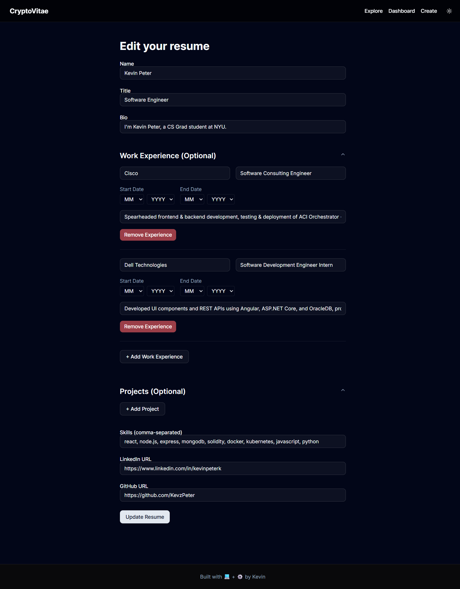

### ✅ Confirm Resume Transaction

MetaMask confirmation popup for minting a resume NFT on the blockchain.
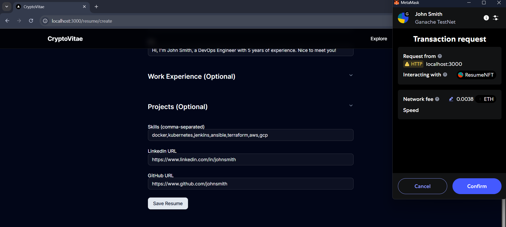

### 🧱 Mint Resume NFT

Interface that confirms resume minting by initiating an on-chain transaction.
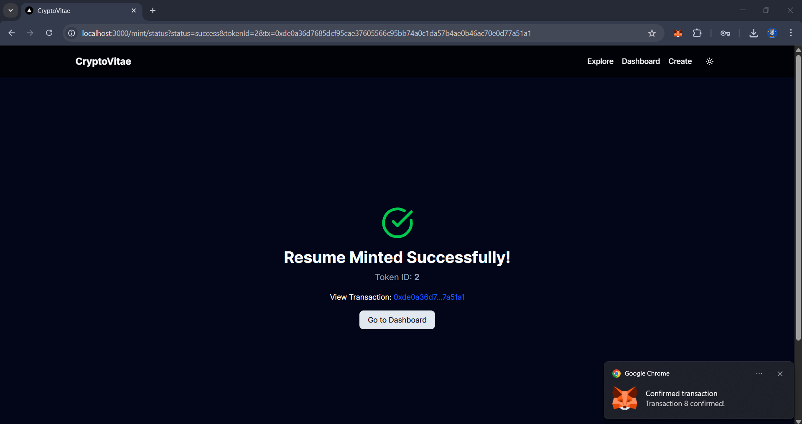

### ✍️ Adding Endorsements

MetaMask popup to confirm the endorsement transaction on-chain.
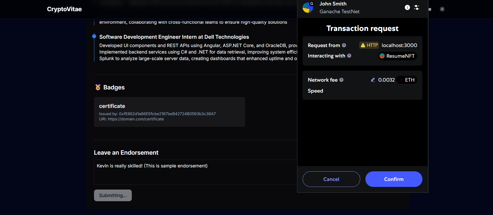

### 🤝 Confirmed Endorsement

Form where a user endorses another user’s resume by signing a message.
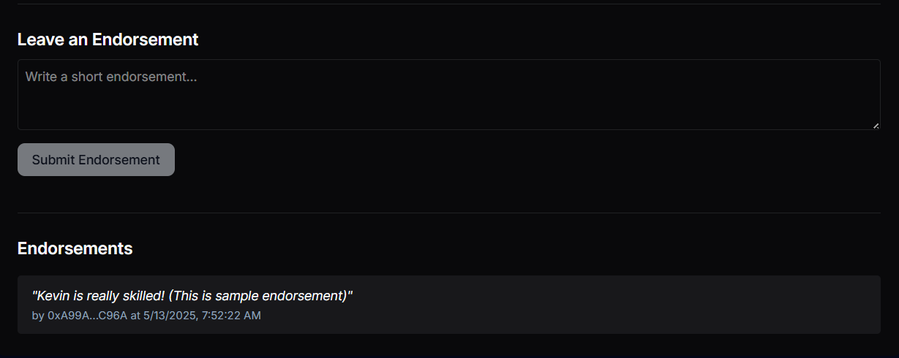

### 📊 Dashboard Page

Personal dashboard page with resume
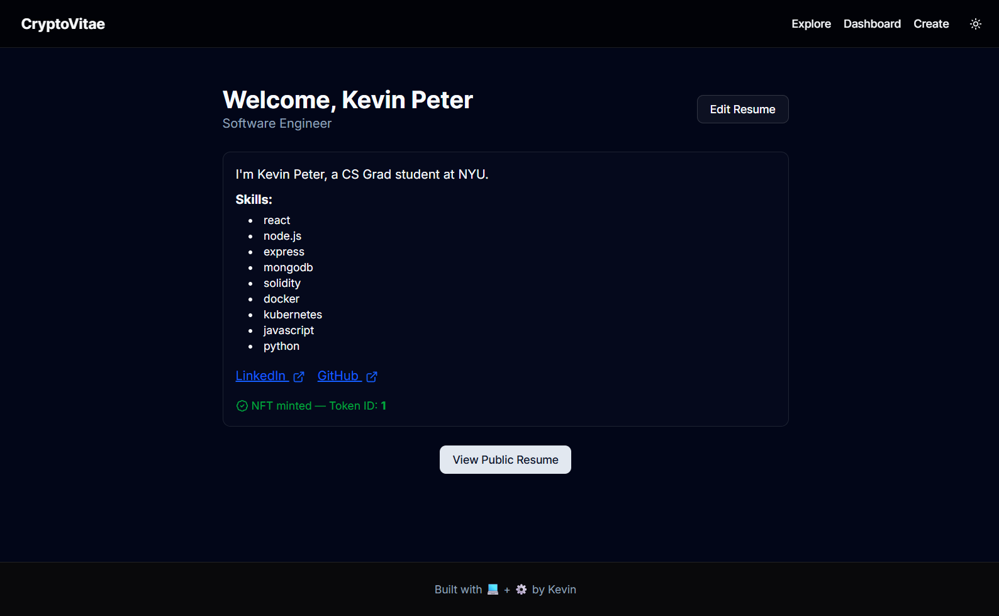

### 🧾 Transaction Log (Ganache)

Shows a list of blockchain transactions during local testing with Ganache.
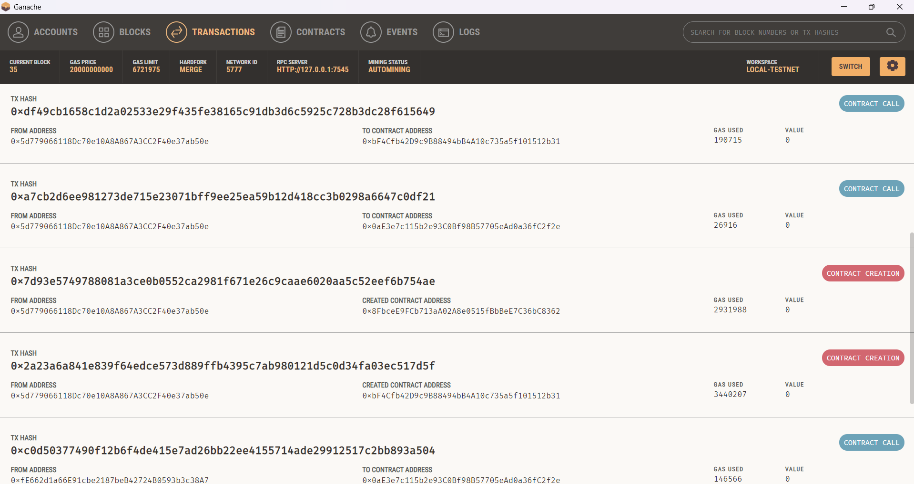

---

## 🚀 Features

- 🔐 **Resume NFTs** — Mint resumes to your wallet as verifiable ERC-721 tokens
- 👍 **Peer Endorsements** — On-chain endorsements from other wallet holders
- 🏅 **Organization-Issued Badges** — Verifiable credentials issued by whitelisted orgs
- 🌐 **Public Resume Viewer** — View resumes at `/resume/view/[wallet]` with QR export
- 🔍 **Explore Page** — Browse public resumes with filters and badge highlights
- 📦 **MongoDB Storage** — Off-chain metadata management for resume and badge content

---

## ⚙️ Smart Contracts

Smart contracts are located in the [`/contracts`](./contracts) directory.

- [`ResumeNFT.sol`](./contracts/ResumeNFT.sol)  
  Handles resume NFT minting and on-chain endorsements. Includes:

  - `mintResume`: Mints a resume with metadata and hash
  - `endorseResume`: Stores peer endorsements (no self/duplicate endorsements)
  - `verifyResume`: Compares resume hash for authenticity

- [`BadgeNFT.sol`](./contracts/BadgeNFT.sol)  
  Lets whitelisted organizations issue badge NFTs. Includes:
  - `whitelistOrg`: Owner-only function to whitelist an org
  - `mintBadge`: Mints a badge NFT with type and URI
  - Emits a `BadgeIssued` event on every badge mint

---

## 📦 Tech Stack

| Layer      | Technology                            |
| ---------- | ------------------------------------- |
| Frontend   | Next.js, TailwindCSS, Shadcn UI       |
| Backend    | Node.js, Express.js, MongoDB Atlas    |
| Blockchain | Solidity, Hardhat, Ganache, Ethers.js |
| Wallet     | MetaMask                              |

---

## 🧰 Requirements

- Node.js v18+
- Yarn or npm
- MongoDB local instance at `mongodb://localhost:27017/cryptovitae`
- MetaMask browser extension
- Ganache (local testnet)
- Hardhat (for smart contract compilation and deployment)

---

## ⚙️ Setup Instructions

### 1. Clone the repository

```bash
git clone https://github.com/KevzPeter/CryptoVitae.git
cd cryptovitae
```

---

### 2. Install dependencies

```bash
cd backend
npm install

cd ../frontend
npm install
```

---

### 3. Environment Variables

Only the backend requires an `.env` file.

**backend/.env**

```env
MONGO_URI=mongodb://localhost:27017/cryptovitae
```

---

### 4. Compile Smart Contracts

```bash
npx hardhat compile
```

---

### 5. Run Ganache

Make sure Ganache is running locally at `http://127.0.0.1:8545`.

---

### 6. Deploy Smart Contracts (ResumeNFT + BadgeNFT)

Run the deployment and org-whitelisting scripts:

```bash
npx hardhat run scripts/deploy.js --network localhost
npx hardhat run scripts/whitelist-orgs.js --network localhost
```

Copy the deployed contract addresses from the console into:

- `backend/config/constants.js`
- `frontend/src/lib/constants.ts`

---

### 7. Start the backend server

```bash
cd backend
npm run dev
```

---

### 8. Start the frontend dev server

```bash
cd frontend
npm run dev
```

---

## 🧑‍💻 App Usage

1. **Connect Wallet:** Use MetaMask to sign in
2. **Create Resume:** Fill out the form and submit. Then an NFT will be minted
3. **View Resume:** Navigate to `/resume/view/[wallet]` to share your profile
4. **Endorse:** Visit another user’s resume and click “Endorse”
5. **Issue Badges:** Organizations can mint badges to wallets they’ve verified
6. **Explore Resumes:** Browse public resumes via `/explore`

---

## 📹 Live Demo

[Click here to watch the demo!](https://www.youtube.com/watch?v=YOUR_VIDEO_ID)

---

## 📌 Future Roadmap

- [ ] Integrate AI-powered resume scoring and suggestions
- [ ] Store metadata on IPFS instead of MongoDB
- [ ] DAO-controlled whitelisting of organizations
- [ ] ERC-7529 support for off-chain signed attestations
- [ ] Cross-chain resume NFT compatibility
- [ ] ENS/DID-based identity integration
- [ ] Recruiter-side dashboard with filters and outreach tools

---
